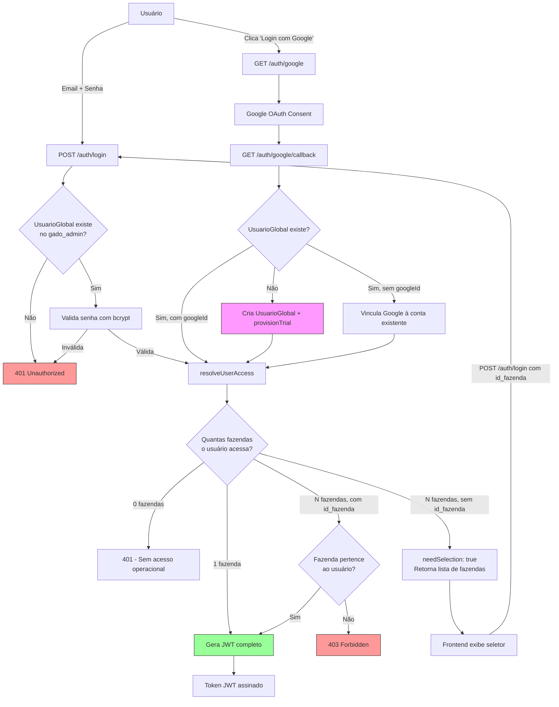
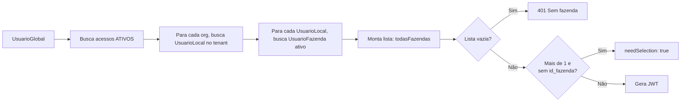

# 🔐 Fluxo de Autenticação

> Detalha os dois fluxos de login (Email/Senha e Google OAuth), a seleção de fazenda, e o conteúdo do JWT.

---

## 1. Visão Geral do Fluxo



## 2. Endpoints

| Método | Rota | Descrição | Auth? |
|---|---|---|---|
| `POST` | `/auth/login` | Login email/senha (ou seleção de tenant) | ❌ |
| `GET` | `/auth/google` | Inicia OAuth com Google | ❌ |
| `GET` | `/auth/google/callback` | Callback do Google → redirect com token | ❌ |

## 3. Login por Email/Senha

**Arquivo**: [`auth.service.ts`](file:///c:/Users/Joao%20Puccini/Desktop/repositorios-git/gado/gado-api/src/auth/auth.service.ts)

### Passo a Passo:
1. Busca `UsuarioGlobal` no schema `gado_admin` pelo email
2. Verifica `ativo === true`
3. Compara senha com `bcrypt.compare()`
4. Chama `resolveUserAccess()` para montar o contexto de fazenda

### LoginDto:
```typescript
{
  email: string;      // obrigatório
  password?: string;  // opcional (seleção de tenant pode omitir)
  id_fazenda?: number; // opcional (seleção de tenant envia este campo)
}
```

## 4. Login por Google OAuth

**Arquivo**: [`google.strategy.ts`](file:///c:/Users/Joao%20Puccini/Desktop/repositorios-git/gado/gado-api/src/auth/strategies/google.strategy.ts)

### Passo a Passo:
1. Redirect para Google OAuth consent
2. Google retorna para `/auth/google/callback` com profile
3. Se `UsuarioGlobal` **não existe**: cria + provisionTrial automático
4. Se existe mas **sem googleId**: vincula Google à conta existente
5. Chama `resolveUserAccess()`

### Auto-Provisionamento (provisionTrial):
**Arquivo**: [`social-provisioning.service.ts`](file:///c:/Users/Joao%20Puccini/Desktop/repositorios-git/gado/gado-api/src/auth/services/social-provisioning.service.ts)

Quando um novo usuário Google se registra, o sistema automaticamente:
1. Cria `Organizacao` com status `TRIAL`
2. Cria `TenantRegistry` com status `ATIVO`
3. Cria `AcessoOrganizacao` com role `PROPRIETARIO`
4. Cria `Plano Trial` (2 usuários, 1 fazenda, R$0/mês)
5. Cria `Assinatura` ativa por 30 dias
6. Cria **schema PostgreSQL** (ex: `fazenda_joao`)
7. Faz seed de permissões, perfis, raça/lote/pasto default
8. Cria `UsuarioLocal` no tenant + `Fazenda Principal` + vínculo `DONO`

## 5. Resolução de Acesso (resolveUserAccess)



### Payload do JWT:
```typescript
{
  sub: string;           // ID do UsuarioGlobal (UUID)
  email: string;
  nome: string;
  tenantId: string;      // ID da Organizacao (UUID)
  schemaName: string;    // Ex: "fazenda_joao"
  usuarioLocalId: number; // ID do Usuario no tenant
  fazendaId: number;     // ID da fazenda selecionada
  role: string;          // "DONO" | "GESTOR" | "COLABORADOR" | etc.
  permissoes: string[];  // Array de "modulo:acao"
}
```

## 6. Seleção de Fazenda (Multi-Tenant / Multi-Fazenda)

Quando o usuário tem acesso a **mais de 1 fazenda** e não especifica qual:

### Resposta `needSelection`:
```json
{
  "needSelection": true,
  "id_fazendas": [1, 2, 3],
  "fazendas": [
    { "id": 1, "nome": "Fazenda Matriz" },
    { "id": 2, "nome": "Fazenda Sul" },
    { "id": 3, "nome": "Fazenda Norte" }
  ],
  "user": {
    "id": "uuid-global",
    "nome": "João",
    "email": "joao@email.com"
  }
}
```

### Frontend:
1. Recebe `needSelection: true`
2. Exibe tela de seleção de fazendas
3. Usuário clica na fazenda desejada
4. Frontend faz novo `POST /auth/login` com `email + id_fazenda` (sem senha)
5. Backend retorna JWT definitivo

### Google OAuth (multi-fazenda):
- Redirect para `/selecionar-fazenda?state={base64_json}` no frontend
- Frontend decodifica o state e exibe seletor

## 7. Estratégias Passport

| Estratégia | Arquivo | Uso |
|---|---|---|
| `JwtStrategy` | [`jwt.strategy.ts`](file:///c:/Users/Joao%20Puccini/Desktop/repositorios-git/gado/gado-api/src/auth/strategies/jwt.strategy.ts) | Valida Bearer token em rotas protegidas |
| `GoogleStrategy` | [`google.strategy.ts`](file:///c:/Users/Joao%20Puccini/Desktop/repositorios-git/gado/gado-api/src/auth/strategies/google.strategy.ts) | OAuth 2.0 com Google |

## 8. Guards de Autenticação

| Guard | Arquivo | Função |
|---|---|---|
| `JwtAuthGuard` | [`jwt-auth.guard.ts`](file:///c:/Users/Joao%20Puccini/Desktop/repositorios-git/gado/gado-api/src/auth/guards/jwt-auth.guard.ts) | Exige token JWT válido |
| `PermissionsGuard` | [`permissions.guard.ts`](file:///c:/Users/Joao%20Puccini/Desktop/repositorios-git/gado/gado-api/src/auth/guards/permissions.guard.ts) | Verifica permissões RBAC (ex: `animais:criar`) |
