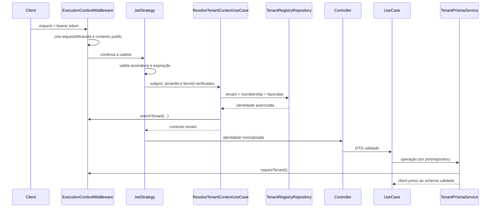
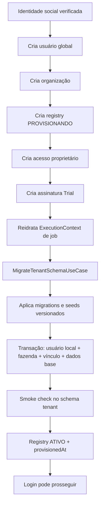

# Multi-tenancy — isolamento por schema

Este documento descreve a fundação vigente após a Onda 00. Cada organização possui um schema PostgreSQL dedicado; fazendas da mesma organização permanecem separadas por `fazendaId` dentro desse schema.

## 1. Bancos lógicos e migrations

### Catálogo administrativo

- Schema Prisma: [`prisma/admin/schema.prisma`](../prisma/admin/schema.prisma)
- Migrations: [`prisma/admin/migrations`](../prisma/admin/migrations)
- Schema PostgreSQL: `gado_admin`
- Responsabilidades: organizações, registry de tenants, usuários globais, acessos, planos, assinaturas, pagamentos, convites e usuários internos do Gado Admin.

Produção aplica essa cadeia somente por:

```bash
npx prisma migrate deploy --config prisma.config.ts
```

### Dados operacionais do tenant

- Schema Prisma: [`prisma/tenant/schema.prisma`](../prisma/tenant/schema.prisma)
- Migrations: [`prisma/tenant/migrations`](../prisma/tenant/migrations)
- Nome físico: `tenant_<32 caracteres hexadecimais minúsculos>`
- Responsabilidades: usuários locais, fazendas, RBAC e módulos operacionais.

Cada migration tenant contém apenas o marcador reservado `"__tenant__"`. O loader calcula SHA-256 do SQL, e o repository:

1. valida o nome por `TenantSchemaName`;
2. adquire advisory lock transacional por schema;
3. substitui exclusivamente o marcador por um identificador validado e escapado;
4. aplica o SQL em transação;
5. registra `version`, `checksum` e `appliedAt` em `_gado_tenant_migrations`.

Não há `db push`, cópia de tabelas de `public`, alteração compartilhada de `search_path` nem rewrite de queries de negócio.

## 2. Autoridade e contexto

Há exatamente um `ExecutionContextStore`, implementado com `AsyncLocalStorage` em [`src/common/context/execution-context.store.ts`](../src/common/context/execution-context.store.ts).

O middleware global cria apenas o contexto público e a correlação da request. Ele não escolhe tenant. Depois que o Passport valida a assinatura do JWT, `ResolveTenantContextUseCase` confirma:

- tenant e organização no registry administrativo;
- status ativo;
- vínculo do usuário global com a organização;
- usuário local ativo;
- acesso à fazenda solicitada e permissões efetivas.

Somente então o contexto é enriquecido com `tenantId`, `organizationId`, `schemaName`, `globalUserId`, `localUserId`, `farmId`, `accessibleFarmIds` e `permissions`.

`x-tenant` ou subdomínio podem funcionar como hints de transporte, mas nunca são autoridade isolada. Body, query, path e `schemaName` enviado pelo cliente não selecionam o banco.



Qualquer tentativa de obter o client sem contexto tenant completo falha fechada com erro de domínio.

## 3. Client Prisma por tenant

[`TenantPrismaClientFactory`](../src/tenant/infrastructure/tenant-prisma-client.factory.ts) cria e mantém um client por `TenantSchemaName`, usando a opção nativa `schema` do adapter `PrismaPg`. A factory limita cada pool e libera todos os clients no encerramento do módulo.

[`TenantPrismaService`](../src/tenant/tenant-prisma.service.ts) não aceita schema por parâmetro e não possui client default. Seu único caminho público usa `ExecutionContextStore.requireTenant()`.

O isolamento entre fazendas da mesma organização continua sendo uma obrigação explícita de cada repository/use case: toda leitura e mutação operacional deve usar o `farmId` autorizado do contexto. Não existe interceptor genérico que reescreva SQL ou injete filtros silenciosamente.

## 4. Provisionamento de um tenant

O onboarding social mantém o registry em `PROVISIONANDO` até toda a infraestrutura e os dados mínimos serem validados:



O tenant não é marcado como ativo quando migrations, seeds, transação inicial ou smoke check falham. Os logs do fluxo são JSON estruturado e recebem automaticamente a correlação do contexto de job.

## 5. Garantias automatizadas

- concorrência entre requests não vaza contexto;
- dois schemas PostgreSQL reais não retornam dados um do outro;
- admin vazio, tenant vazio e upgrade/retry partem apenas das migrations commitadas;
- checksums alterados e versões desconhecidas falham fechados;
- scanner arquitetural proíbe UseCase -> framework e acesso direto à infraestrutura de outro módulo;
- contrato OpenAPI bloqueia endpoints novos sem tags, operação, segurança, DTOs, envelopes e erros documentados;
- cobertura da fundação possui threshold mínimo de 80% em todas as métricas.

As evidências observadas estão em [`docs/testing/wave-00-backend-foundation.tdd.md`](testing/wave-00-backend-foundation.tdd.md).
