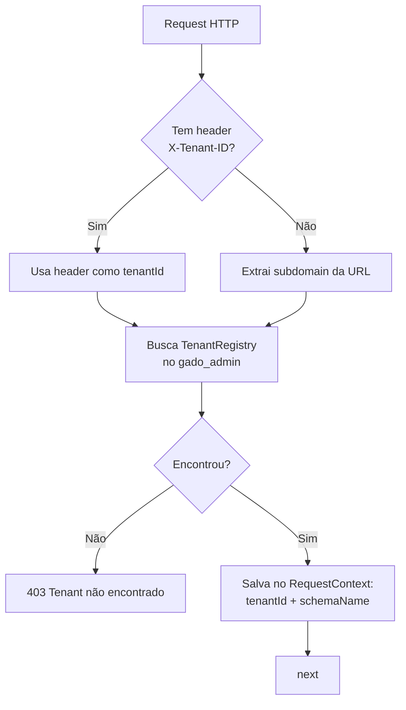
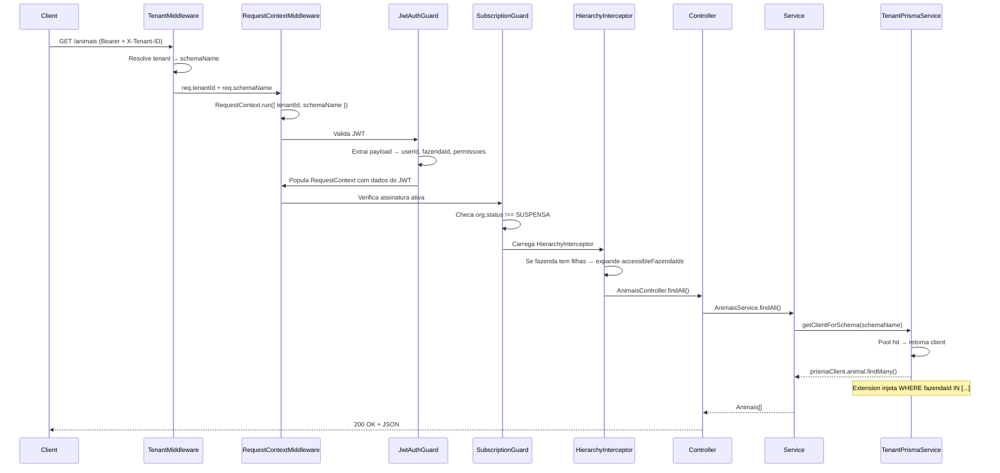
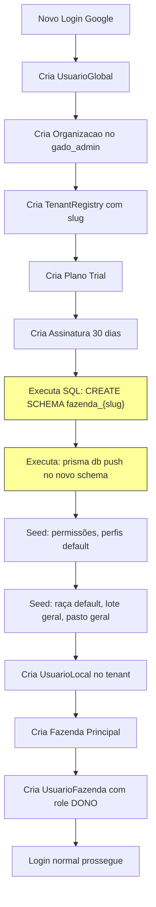

# 🏢 Multi-Tenancy — Isolamento de Dados por Schema

> Explica como cada cliente (organização) opera em seu próprio schema PostgreSQL com isolamento total.

---

## 1. Conceito

Cada organização cadastrada no sistema recebe um **schema PostgreSQL dedicado** (ex: `fazenda_joao`, `fazenda_maria`). Isso garante que os dados de um cliente **nunca se misturam** com os de outro — nem por erro de query, nem por injection.

## 2. Componentes do Multi-Tenant

### 2.1 Schema Admin (`gado_admin`)
**Prisma Schema**: [`schema-admin.prisma`](file:///c:/Users/Joao%20Puccini/Desktop/repositorios-git/gado/gado-api/prisma/schema-admin.prisma)

Tabelas globais do SaaS:
| Tabela | Função |
|---|---|
| `organizacoes` | Cadastro da empresa do cliente |
| `tenant_registry` | Mapeia `slug → schemaName` para resolução de tenant |
| `usuarios_globais` | Usuários que podem acessar múltiplas orgs |
| `acesso_organizacoes` | Vínculo user↔org com role global (PROPRIETARIO/ADMIN/MEMBRO) |
| `planos` | Planos disponíveis (Trial, Básico, Pro, Enterprise) |
| `assinaturas` | Assinatura ativa de cada organização |
| `pagamentos` | Histórico de pagamentos |
| `convites` | Convites pendentes para novos membros |
| `admin_users` | Administradores do sistema (superadmins) |

### 2.2 Schema do Tenant (`fazenda_{slug}`)
**Prisma Schema**: [`schema.prisma`](file:///c:/Users/Joao%20Puccini/Desktop/repositorios-git/gado/gado-api/prisma/schema.prisma)

Tabelas operacionais de cada cliente. Todos os módulos de negócio (animais, lotes, pastos, custos, vendas, etc.) vivem aqui.

## 3. Resolução do Tenant

### 3.1 TenantMiddleware
**Arquivo**: [`tenant.middleware.ts`](file:///c:/Users/Joao%20Puccini/Desktop/repositorios-git/gado/gado-api/src/tenant/tenant.middleware.ts)



**Precedência de resolução:**
1. Header `X-Tenant-ID` (usado pelo frontend SPA)
2. Subdomain do `Host` (usado em deploy com domínios personalizados)

### 3.2 TenantPrismaService — Pool de Conexões
**Arquivo**: [`tenant-prisma.service.ts`](file:///c:/Users/Joao%20Puccini/Desktop/repositorios-git/gado/gado-api/src/tenant/tenant-prisma.service.ts)

#### Arquitetura:
```
┌─────────────────────────────────────────────┐
│         TenantPrismaService                 │
│                                             │
│  Map<schemaName, PrismaClient>  (pool)      │
│                                             │
│  getClientForSchema("fazenda_joao")         │
│    ├── Pool hit? → retorna PrismaClient     │
│    └── Pool miss? → cria novo               │
│         1. new Pool(connectionString)       │
│         2. new PrismaPg(pool, schema)       │
│         3. new PrismaClient({ adapter })    │
│         4. Aplica Prisma Extension ($allOps)│
│         5. Adiciona ao pool                 │
│         6. Retorna                          │
│                                             │
│  cleanupIdleConnections() ← @Cron('0 * *') │
│    → Remove clientes ociosos > 15min        │
└─────────────────────────────────────────────┘
```

#### Prisma Extension (Row-Level Security):
```typescript
// O extension intercepta TODAS as operações Prisma (findMany, create, update, delete...)
// e injeta automaticamente o filtro `fazendaId IN accessibleFazendaIds`
// para models que possuem o campo `fazendaId`.

// Isso garante que:
// 1. Um usuário logado na "Fazenda A" não acessa dados da "Fazenda B"
// 2. Um dono da Matriz vê dados de TODAS as fazendas que possui
// 3. Nunca é possível injetar um fazendaId forjado via API
```

**Models com filtro automático de fazendaId:**
- `Animal`, `Lote`, `Pasto`, `Custo`, `Venda`, `Caixa`, `Vacinacao`
- `Pesagem`, `Movimentacao`, `Almoxarifado`, `Maquina`
- Basicamente **todo model que tem `fazendaId`** como campo

## 4. RequestContext (AsyncLocalStorage)
**Arquivo**: [`request-context.ts`](file:///c:/Users/Joao%20Puccini/Desktop/repositorios-git/gado/gado-api/src/common/context/request-context.ts)

Dados persistidos por request:
```typescript
interface RequestContextData {
    requestId: string;           // UUID do request
    globalUserId?: string;       // UUID do UsuarioGlobal
    userId?: number;             // ID do UsuarioLocal no tenant
    userEmail?: string;
    tenantId?: string;           // UUID da Organizacao
    schemaName?: string;         // Ex: "fazenda_joao"
    fazendaId?: number;          // ID da fazenda selecionada
    accessibleFazendaIds?: number[];  // IDs de todas fazendas que o user acessa
    path?: string;               // Ex: "/animais"
    method?: string;             // Ex: "GET"
    startTime: number;           // Timestamp do início
}
```

**Usos no código:**
- `RequestContext.getSchemaName()` → determina qual PrismaClient usar
- `RequestContext.getFazendaId()` → filtro de fazenda em queries
- `RequestContext.getAccessibleFazendaIds()` → visão matriz ou fazenda única

## 5. Fluxo Completo de uma Request



## 6. Provisionamento de Novo Tenant

Quando um novo cliente se cadastra (via Google OAuth):


