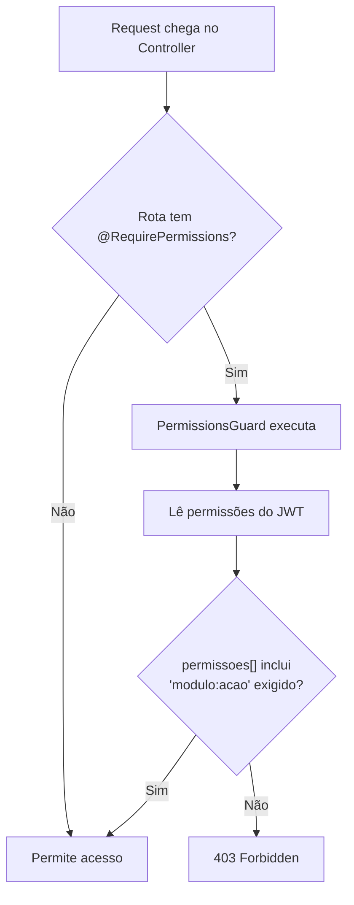

# 🛡️ RBAC — Roles, Permissões e Perfis

> Explica como funciona a autorização baseada em roles (RBAC), a segregação de perfis, e os guards que protegem cada rota.

---

## 1. Fonte da Verdade

**Arquivo**: [`rbac.config.ts`](file:///c:/Users/Joao%20Puccini/Desktop/repositorios-git/gado/gado-api/src/common/rbac/rbac.config.ts)

Este é o **único arquivo** que define módulos, ações e roles. É compartilhado entre backend (guards) e frontend (menus).

## 2. Enums

### Módulos do Sistema (`AppModule`)
| Enum | Módulo |
|---|---|
| `DASHBOARD` | Painel principal |
| `ANIMAIS` | Cadastro e gestão de animais |
| `PESAGENS` | Pesagens e evolução de peso |
| `SANIDADE` | Vacinações e sanidade |
| `MANEJO` | Manejo reprodutivo |
| `FINANCEIRO` | Caixa, custos, vendas |
| `PASTOS` | Pastos e geolocalização |
| `LOTES` | Lotes de animais |
| `RACAS` | Raças |
| `CLIENTES` | Compradores/parceiros |
| `FOTOS` | Fotos de animais |
| `MOVIMENTACOES` | Movimentação entre pastos/lotes |
| `CONFIGURACOES` | Configurações da fazenda |

### Ações (`AppAction`)
| Enum | Significado |
|---|---|
| `LER` | Visualizar dados |
| `CRIAR` | Criar novos registros |
| `EDITAR` | Alterar registros existentes |
| `EXCLUIR` | Deletar registros |
| `GERENCIAR` | **Inclui todas as ações acima** |

### Roles da Fazenda (`FazendaRole`)
| Role | Descrição |
|---|---|
| `DONO` | Proprietário da fazenda — **acesso total, bypass de permissões** |
| `GESTOR` | Gerente com acesso total operacional, sem configurações de gerenciar |
| `COLABORADOR` | Peão/funcionário com acesso limitado a criar/editar |
| `VETERINARIO` | Acesso focado em sanidade e manejo |
| `CONSULTOR` | Somente leitura em todos os módulos |

## 3. Matriz de Permissões

```
┌───────────────┬───────┬────────┬─────────────┬──────────────┬───────────┐
│ Módulo        │ DONO  │ GESTOR │ COLABORADOR │ VETERINÁRIO  │ CONSULTOR │
├───────────────┼───────┼────────┼─────────────┼──────────────┼───────────┤
│ dashboard     │ ✅ ler │ ✅ ler  │ ✅ ler       │ ✅ ler        │ ✅ ler     │
│ animais       │ ✅ ALL │ ✅ ALL  │ LCE         │ ler          │ ler       │
│ pesagens      │ ✅ ALL │ ✅ ALL  │ LC          │ LC           │ ler       │
│ sanidade      │ ✅ ALL │ ✅ ALL  │ LC          │ ✅ ALL        │ ler       │
│ manejo        │ ✅ ALL │ ✅ ALL  │ LC          │ ✅ ALL        │ ler       │
│ financeiro    │ ✅ ALL │ ✅ ALL  │ ❌           │ ❌            │ ler       │
│ pastos        │ ✅ ALL │ ✅ ALL  │ ler         │ ❌            │ ler       │
│ lotes         │ ✅ ALL │ ✅ ALL  │ ler         │ ❌            │ ler       │
│ racas         │ ✅ ALL │ ✅ ALL  │ ler         │ ❌            │ ler       │
│ clientes      │ ✅ ALL │ ✅ ALL  │ ❌           │ ❌            │ ler       │
│ fotos         │ ✅ ALL │ ✅ ALL  │ LC          │ LC           │ ler       │
│ movimentações │ ✅ ALL │ ✅ ALL  │ LC          │ ❌            │ ler       │
│ configurações │ ✅ ALL │ ler    │ ❌           │ ❌            │ ❌         │
└───────────────┴───────┴────────┴─────────────┴──────────────┴───────────┘

Legenda: ALL = gerenciar (LCE+D), LCE = ler+criar+editar, LC = ler+criar
```

## 4. Como a Autorização Funciona

### 4.1 Fluxo do Guard de Permissões



### 4.2 Ação `gerenciar` é Coringa

Se um role tem `animais:gerenciar`, ele automaticamente possui `animais:ler`, `animais:criar`, `animais:editar` e `animais:excluir`:

```typescript
function hasPermission(role, module, action): boolean {
  if (role === 'DONO') return true; // bypass total
  const permissions = RolePermissions[role];
  return permissions.includes(`${module}:${action}`) 
      || permissions.includes(`${module}:gerenciar`);
}
```

### 4.3 Exemplo de Uso no Controller

```typescript
@Get()
@RequirePermissions(AppModule.ANIMAIS, AppAction.LER)
async findAll() { ... }

@Post()
@RequirePermissions(AppModule.ANIMAIS, AppAction.CRIAR)
async create(@Body() dto: CreateAnimalDto) { ... }

@Delete(':id')
@RequirePermissions(AppModule.ANIMAIS, AppAction.EXCLUIR)
async remove(@Param('id') id: string) { ... }
```

## 5. Duas Camadas de Role

O sistema possui **duas camadas de role**:

### Camada 1: Role Global (AcessoOrganizacao)
| Role | Onde | Significado |
|---|---|---|
| `PROPRIETARIO` | `gado_admin.acesso_organizacoes` | Criou a organização, pode gerenciar billing |
| `ADMIN` | `gado_admin.acesso_organizacoes` | Admin da org, pode convidar membros |
| `MEMBRO` | `gado_admin.acesso_organizacoes` | Membro convidado |

### Camada 2: Role Operacional (UsuarioFazenda)
| Role | Onde | Significado |
|---|---|---|
| `DONO` | `tenant.usuario_fazenda` | Dono da fazenda específica |
| `GESTOR` | `tenant.usuario_fazenda` | Gerente da fazenda |
| `COLABORADOR` | `tenant.usuario_fazenda` | Funcionário da fazenda |
| `VETERINARIO` | `tenant.usuario_fazenda` | Veterinário da fazenda |
| `CONSULTOR` | `tenant.usuario_fazenda` | Consultor externo |

### Quando cada uma é usada?
- **Role Global** → usado no `SubscriptionGuard` para verificar status de assinatura
- **Role Operacional** → usado no `PermissionsGuard` para controlar acesso a funcionalidades

## 6. Guards do Sistema

| Guard | Escopo | Função |
|---|---|---|
| `JwtAuthGuard` | Rota | Valida que o request tem um JWT válido |
| `PermissionsGuard` | Rota | Verifica permissões RBAC (módulo:ação) |
| `SubscriptionGuard` | Global | Verifica que a organização tem assinatura ativa |
| `ThrottlerGuard` | Global | Rate limiting (100 req/60s) |

### Ordem de execução:
```
Request → JwtAuthGuard → SubscriptionGuard → ThrottlerGuard → PermissionsGuard → Controller
```

## 7. Decorators

| Decorator | Arquivo | Uso |
|---|---|---|
| `@RequirePermissions(module, action)` | [`roles.decorator.ts`](file:///c:/Users/Joao%20Puccini/Desktop/repositorios-git/gado/gado-api/src/common/decorators/roles.decorator.ts) | Marca a permissão necessária na rota |
| `@CurrentUser()` | [`current-user.decorator.ts`](file:///c:/Users/Joao%20Puccini/Desktop/repositorios-git/gado/gado-api/src/common/decorators/current-user.decorator.ts) | Extrai dados do usuário do JWT |
| `@CurrentFazenda()` | [`current-fazenda.decorator.ts`](file:///c:/Users/Joao%20Puccini/Desktop/repositorios-git/gado/gado-api/src/common/decorators/current-fazenda.decorator.ts) | Extrai fazendaId do contexto |
