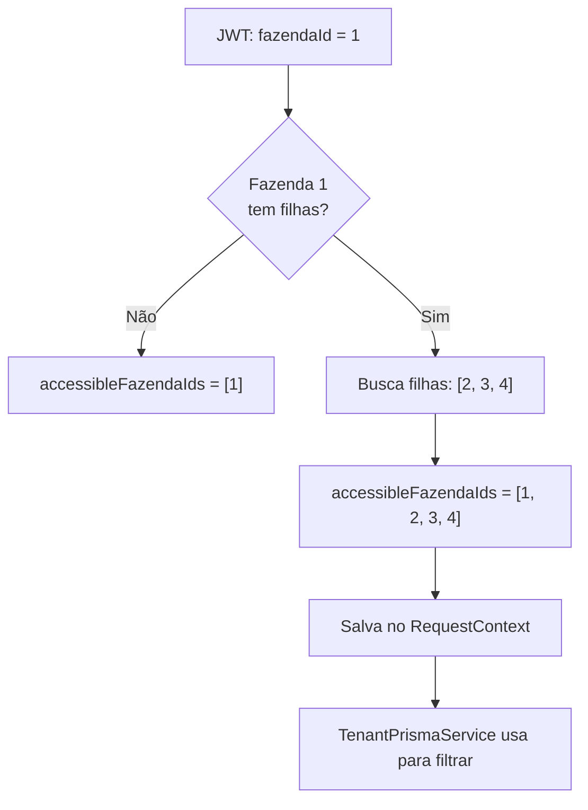
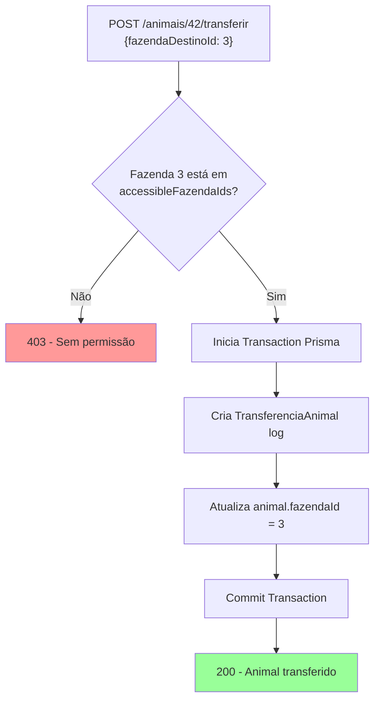

# 🏗️ Hierarquia de Fazendas — Visão Matriz

> Explica o conceito de fazendas pai/filha, a visão da Matriz, e o fluxo de transferência de animais entre fazendas.

---

## 1. Conceito

Uma organização pode ter **múltiplas fazendas**. O modelo suporta hierarquia:

```
📁 Fazenda Matriz (parentId: null)
├── 📁 Fazenda Sul (parentId: 1)
├── 📁 Fazenda Norte (parentId: 1)
└── 📁 Fazenda Leste (parentId: 1)
```

- **Fazenda Matriz** = `parentId IS NULL` (raiz da árvore)
- **Fazenda Filha** = `parentId = <id da matriz>` (pertence a uma matriz)

## 2. Model no Prisma

```prisma
model Fazenda {
  id        Int       @id @default(autoincrement())
  nome      String
  parentId  Int?      @map("parent_id")
  parent    Fazenda?  @relation("HierarquiaFazenda", fields: [parentId], references: [id])
  filhas    Fazenda[] @relation("HierarquiaFazenda")
  // ...
}
```

## 3. UsuarioFazenda — Vínculo de Acesso

```prisma
model UsuarioFazenda {
  id         Int     @id @default(autoincrement())
  usuarioId  Int     @map("usuario_id")
  fazendaId  Int     @map("fazenda_id")
  role       String  // DONO, GESTOR, COLABORADOR, VETERINARIO, CONSULTOR
  ativo      Boolean @default(true)
}
```

Um usuário pode estar vinculado a **múltiplas fazendas** dentro do mesmo tenant, cada uma com um role diferente:

```
João:
  ├── Fazenda Matriz → DONO
  ├── Fazenda Sul    → DONO
  └── Fazenda Norte  → DONO

Carlos (funcionário):
  └── Fazenda Sul    → COLABORADOR
```

## 4. HierarchyInterceptor

**Arquivo**: [`hierarchy.interceptor.ts`](file:///c:/Users/Joao%20Puccini/Desktop/repositorios-git/gado/gado-api/src/common/interceptors/hierarchy.interceptor.ts)

Quando o usuário loga na **Fazenda Matriz**, o interceptor expande `accessibleFazendaIds` para incluir todas as filhas:



### Efeito Prático:

| Cenário | fazendaId selecionado | accessibleFazendaIds | O que vê? |
|---|---|---|---|
| Dono loga na **Matriz** | 1 | [1, 2, 3, 4] | Dados de TODAS as fazendas |
| Dono loga na **Fazenda Sul** | 2 | [2] | Dados SÓ da Fazenda Sul |
| Colaborador loga na **Fazenda Sul** | 2 | [2] | Dados SÓ da Fazenda Sul |

> **⚠️ Importante:** O filtro `accessibleFazendaIds` é injetado automaticamente pelo `TenantPrismaService` via Prisma Extension. Os services e controllers **não precisam se preocupar** com isso.

## 5. Dashboard da Matriz

O `DashboardService` usa `RequestContext.getFazendaId()` para filtrar. Quando o usuário está na Matriz:

- **Contadores** (animais, lotes, pastos) = soma de todas as fazendas
- **Financeiro** (saldo do caixa) = soma global
- **Peso médio** = média ponderada de todos os animais ativos
- **Evolução** = evolução temporal consolidada

Isso funciona **sem código especial no DashboardService** — o Prisma Extension já injeta `WHERE fazendaId IN [1,2,3,4]` automaticamente.

## 6. Criação de Animais pela Matriz

O `CreateAnimalDto` aceita `fazendaId` opcional:

```typescript
// Se o dono da Matriz enviar fazendaId = 3:
{
  "nome": "Boi Estrela",
  "fazendaId": 3,  // Cria diretamente na Fazenda Norte
  "racaId": 1
}

// Se não enviar fazendaId:
// Usa o fazendaId do RequestContext (fazenda selecionada no login)
```

O sistema valida que o `fazendaId` enviado está dentro do `accessibleFazendaIds` do usuário.

## 7. Transferência de Animais

### Endpoint
```
POST /animais/:id/transferir
```

### DTO
```typescript
{
  "fazendaDestinoId": 3,        // ID da fazenda destino
  "motivo": "Engorda no Norte"  // Motivo da transferência (opcional)
}
```

### Fluxo



### Registro de Histórico

A tabela `TransferenciaAnimal` mantém log completo:

```prisma
model TransferenciaAnimal {
  id              Int      @id @default(autoincrement())
  animalId        Int
  fazendaOrigemId Int
  fazendaDestinoId Int
  motivo          String?
  dataTransferencia DateTime @default(now())
  usuarioId       Int      // quem fez a transferência
}
```
