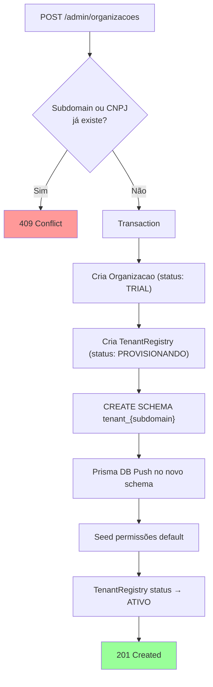
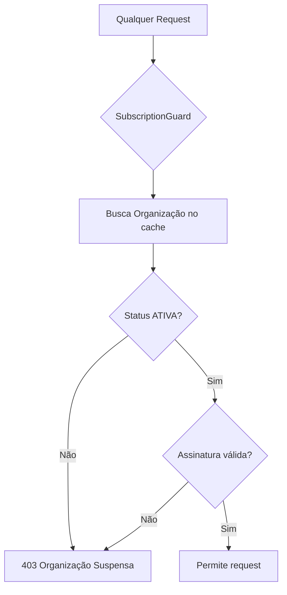
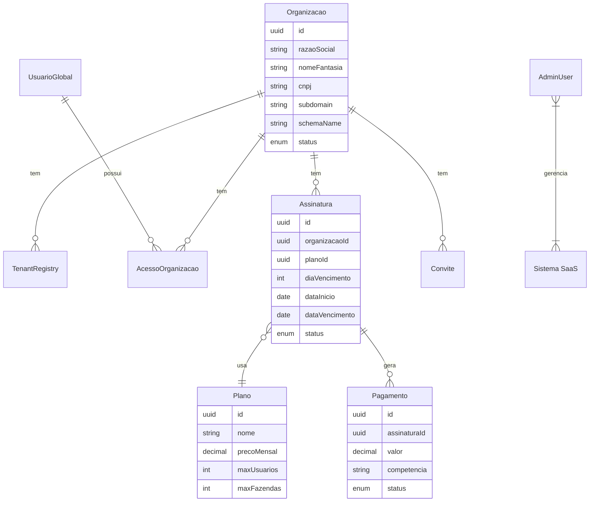

# 🔧 Admin SaaS — Painel Administrativo

> Detalha o módulo Admin que gerencia organizações, planos, assinaturas, pagamentos e usuários do sistema SaaS.

---

## 1. Visão Geral

O módulo Admin opera no schema `gado_admin` e é responsável pela gestão do **SaaS como produto**. Ele não interage com dados operacionais dos tenants — apenas gerencia a infraestrutura multi-tenant.

### AdminPrismaService
**Arquivo**: [`admin-prisma.service.ts`](file:///c:/Users/Joao%20Puccini/Desktop/repositorios-git/gado/gado-api/src/admin/admin-prisma.service.ts)

PrismaClient fixo conectado ao schema `gado_admin`. Diferente do `TenantPrismaService` (dinâmico), este é um singleton estático.

---

## 2. Sub-módulos do Admin

### 2.1 Organizações (`/admin/organizacoes`)

Gestão de empresas/clientes do SaaS.

| Endpoint | Método | Descrição |
|---|---|---|
| `/admin/organizacoes` | GET | Lista todas as organizações |
| `/admin/organizacoes/:id` | GET | Detalhe de uma organização |
| `/admin/organizacoes` | POST | Cria nova organização |
| `/admin/organizacoes/:id` | PATCH | Atualiza organização |
| `/admin/organizacoes/:id` | DELETE | Remove organização |

#### Fluxo de Criação:


#### Status da Organização:
| Status | Significado |
|---|---|
| `TRIAL` | Período de teste (30 dias) |
| `ATIVA` | Assinatura paga ativa |
| `SUSPENSA` | Pagamento em atraso → acesso bloqueado |
| `CANCELADA` | Contrato cancelado |

### 2.2 Planos (`/admin/planos`)

Catálogo de planos disponíveis.

| Endpoint | Método | Descrição |
|---|---|---|
| `/admin/planos` | GET | Lista planos |
| `/admin/planos/:id` | GET | Detalhe de um plano |
| `/admin/planos` | POST | Cria plano |
| `/admin/planos/:id` | PATCH | Atualiza plano |
| `/admin/planos/:id` | DELETE | Remove plano |

#### Estrutura do Plano:
```json
{
  "nome": "Profissional",
  "precoMensal": 149.90,
  "maxUsuarios": 10,
  "maxFazendas": 5,
  "descricao": "Para fazendas de médio porte",
  "ativo": true
}
```

#### Planos Default:
| Plano | Preço | Usuários | Fazendas |
|---|---|---|---|
| Trial | R$ 0 | 2 | 1 |
| Básico | ~R$ 79 | 5 | 2 |
| Profissional | ~R$ 149 | 10 | 5 |
| Enterprise | Customizado | Ilimitado | Ilimitado |

### 2.3 Assinaturas (`/admin/assinaturas`)

Vínculo entre Organização e Plano, com controle de período.

| Endpoint | Método | Descrição |
|---|---|---|
| `/admin/assinaturas` | GET | Lista assinaturas |
| `/admin/assinaturas/:id` | GET | Detalhe de uma assinatura |
| `/admin/assinaturas` | POST | Cria assinatura |
| `/admin/assinaturas/:id` | PATCH | Atualiza assinatura |

#### Estrutura:
```json
{
  "organizacaoId": "uuid",
  "planoId": "uuid",
  "diaVencimento": 15,
  "dataInicio": "2024-01-15",
  "dataVencimento": "2024-02-15",
  "status": "ATIVA"
}
```

#### Geração Automática de Pagamentos:
Ao criar uma assinatura, o sistema pode gerar automaticamente N meses de pagamentos (boletos) com competência `YYYY-MM`:

```typescript
// Se mesesGerarPagamento = 6:
// Gera 6 registros em pagamentos com status PENDENTE
// Cada um com competência mensal (2024-01, 2024-02, ...)
```

### 2.4 Pagamentos (`/admin/pagamentos`)

Registro de pagamentos de assinaturas.

| Endpoint | Método | Descrição |
|---|---|---|
| `/admin/pagamentos` | GET | Lista pagamentos |
| `/admin/pagamentos/:id` | GET | Detalhe de um pagamento |
| `/admin/pagamentos` | POST | Registra pagamento |
| `/admin/pagamentos/:id` | PATCH | Atualiza pagamento |

#### Status do Pagamento:
| Status | Significado |
|---|---|
| `PENDENTE` | Aguardando pagamento |
| `PAGO` | Pagamento confirmado |
| `ATRASADO` | Vencido e não pago |
| `CANCELADO` | Cancelado |

#### Reativação Automática:
Quando um pagamento é registrado como `PAGO`:
1. A assinatura é renovada (nova `dataVencimento`)
2. O cache do tenant é **invalidado imediatamente**
3. Usuários logados param de receber `403 Organização Suspensa`

### 2.5 Usuários Admin (`/admin/usuarios`)

Gestão de administradores do sistema (superadmins).

| Endpoint | Método | Descrição |
|---|---|---|
| `/admin/usuarios` | GET | Lista admin users |
| `/admin/usuarios/:id` | GET | Detalhe de admin user |
| `/admin/usuarios` | POST | Cria admin user |
| `/admin/usuarios/:id` | PATCH | Atualiza admin user |
| `/admin/usuarios/:id` | DELETE | Remove admin user |

---

## 3. SubscriptionGuard — Proteção Global

**Arquivo**: [`subscription.guard.ts`](file:///c:/Users/Joao%20Puccini/Desktop/repositorios-git/gado/gado-api/src/admin/guards/subscription.guard.ts)

Guard global que **bloqueia qualquer request** se:
- A organização está `SUSPENSA` ou `CANCELADA`
- A assinatura expirou (`dataVencimento < now`)



### Cache TTL:
O guard mantém cache da organização para evitar query por request. O cache é invalidado quando:
- Um pagamento é registrado como `PAGO`
- Um admin altera o status da organização

---

## 4. Modelo de Dados Admin


